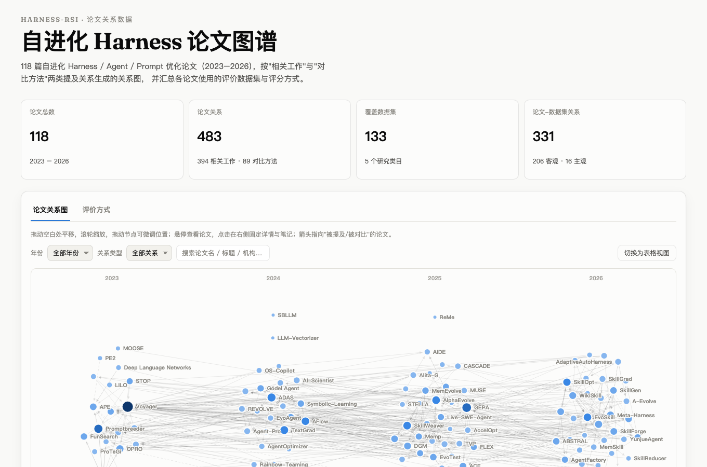
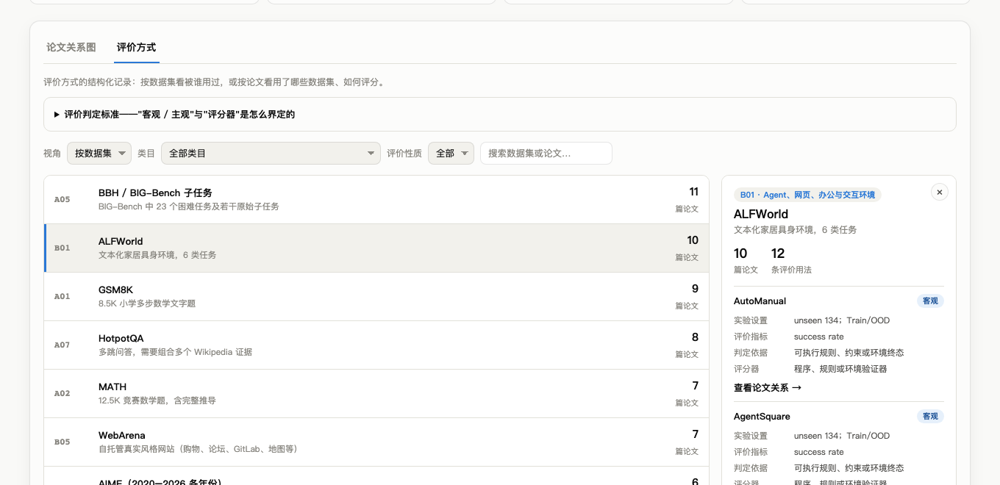

# Harness-RSI

[](LICENSE)
[](data/LICENSE)

**自进化 Harness** 方向的文献图谱：收录让 LLM 系统改进自身提示词、工作流、工具、记忆或代码的论文（2023–2026，目前 118 篇）。对每篇论文，记录它引用了谁、和谁做了对比；另外单独整理它**怎么评测**：用了哪些数据集、哪些指标，评价是客观还是主观。

**在线看板：<https://sigangluo.github.io/Harness-RSI/>**

[](https://sigangluo.github.io/Harness-RSI/)

## 可以做什么

- **看引用关系图**：节点按年份排布，箭头从一篇论文指向它的相关工作章节里提及（394 条）或对比（89 条）的论文。支持按年份、关系类型筛选，按名称 / 标题 / 机构搜索，也可以切成表格。
- **看论文记录**：点击论文，查看摘要、机构、代码链接，以及它提及和对比的论文。
- **对比评测方式**：5 大类共 133 个数据集、331 条论文-数据集使用记录，每条包含实验设置、评价指标、判定依据和评分器。客观 / 主观的判定标准见 [data/evaluation.md](data/evaluation.md)。
- **复用数据**：看板用到的全部数据在 [`paper-relations.json`](https://sigangluo.github.io/Harness-RSI/data/paper-relations.json) 和 [`paper-dataset-relations.json`](https://sigangluo.github.io/Harness-RSI/data/paper-dataset-relations.json)。[PAPERS.md](PAPERS.md) 是可以直接在 GitHub 上浏览的论文目录。

[](https://sigangluo.github.io/Harness-RSI/)

## 收录范围

- **收录**：方法让 LLM 系统进化**自身**或其外壳的论文：提示词优化、Agent 工作流 / 架构搜索、自修改 Agent、技能库与记忆库、Harness 与上下文工程，以及建立在这些思路上的自动化科研 Agent。
- **不收录**：只微调模型权重的工作、没有自我改进闭环的通用工具调用或提示论文，以及审核后判定超出范围的论文。完整清单（292 条，再次遇到无需重复评估）见 [data/excluded.md](data/excluded.md)。拿不准时不收。

## 仓库结构

```
PAPERS.md              按年份的论文目录
data/                  人工维护的数据源
├── metadata/          每年一份：标题、机构、摘要、代码链接、对比方法
├── related-links.json 「论文 A 的相关工作提及论文 B」关系对，关系图的数据来源
├── evaluation.md      评价方式：判定标准、数据集、各论文的使用情况
└── excluded.md        已审核、判定不收录的论文
scripts/               生成看板所需的 JSON；Node.js 18+，无第三方依赖
site/                  静态看板（纯 HTML / CSS / JS，无需构建）
├── data/              生成的 JSON，不要手改
└── assets/
docs/images/           README 截图
```

论文 PDF 和提取出的全文**不在**本仓库中。想在本地留一份可以放进 `papers/`，该目录已被 git 忽略。

## 更新数据

```bash
# 1. 编辑 data/metadata/<年份>.md、data/related-links.json、data/evaluation.md
npm run build          # 重新生成 site/data/*.json（对比关系靠在对比方法文本里匹配论文名得到）
npm run serve          # 本地预览 http://localhost:4322
```

`data/metadata/<年份>.md` 里每篇论文是一个 `### 论文名` 标题加一张字段表（标题、机构、摘要、代码、对比方法）。相关工作原文和单篇阅读笔记不公开；相关工作提及关系以数据形式保存在 `related-links.json` 里，用论文 id（`<年份>-<论文名小写去符号>`）标识。

## 部署

修改 `site/` 的推送会通过 `.github/workflows/deploy-pages.yml` 发布到 GitHub Pages。首次使用请在 Settings → Pages 里把 Source 设为 "GitHub Actions"。

## 参与

这是个人维护的项目，**不接受 Pull Request**，收到会直接关闭。欢迎通过 Issue 提反馈和建议，但不保证回复或采纳。你可以自由 fork，按下面的许可证维护自己的版本。

## 许可

代码（`scripts/`、`site/`）：[MIT](LICENSE)。整理的数据（`data/`、`PAPERS.md`、`site/data/`）：[CC BY 4.0](data/LICENSE)，使用时请注明出处。

数据中包含对论文摘要的中文翻译。论文本身的版权归原作者和出版方所有，不在上述许可范围内，详见 [data/LICENSE](data/LICENSE) 末尾的说明。
